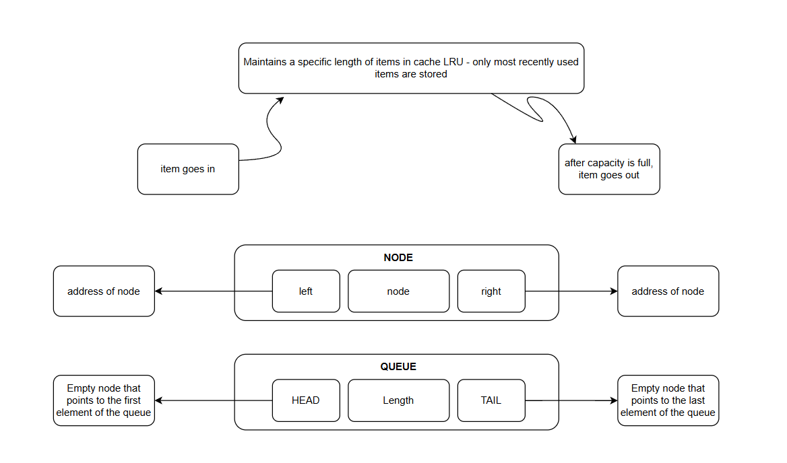

# GoCache
1. [Introduction](#gocache--lru-cache-in-golang)
2. [What is a True LRU Cache?](#what-is-a-true-lru-cache)
3. [Features](#features)
4. [How It Works](#how-it-works)
5. [How to Run](#how-to-run)

---

# GoCache– LRU Cache in Golang
A high-performance LRU (Least Recently Used) Cache implementation built from scratch in Go.
GoCache provides O(1) get/set operations using a combination of hash maps and doubly linked lists, making it ideal for caching workloads that require fast lookups and efficient eviction policies.

# What is a true LRU Cache?

A true LRU cache strictly maintains usage order:

- If an item already exists, it is removed and moved to the front (most recently used end)

- Order of items is preserved at all times

- Insertions happen at the head

- Evictions happen at the tail (least recently used node)

This ensures the cache always removes the item that has been unused for the longest time.

# Features

- **O(1) time complexity** for both Get and Set operations  
- **LRU eviction policy** using a hash map + doubly linked list  
- **Clean, modular, well-structured code**  
- **Easy to extend** or integrate into other systems  

# How It Works

GoCache uses two core data structures:

1. Hash Map
    
    Stores key → node mappings for constant-time lookups.

2. Doubly Linked List

    Tracks usage order

- Most recently used item → moved to front
- Least recently used item → evicted from back

This combination ensures maximum efficiency while maintaining the LRU policy.

# How to Run

Follow these steps to run the project locally:
1. Clone the repository

        git clone https://github.com/<your-username>/GoCache.git

2. Navigate into the project directory

        cd GoCache

3. Run the Go program

        go run .
